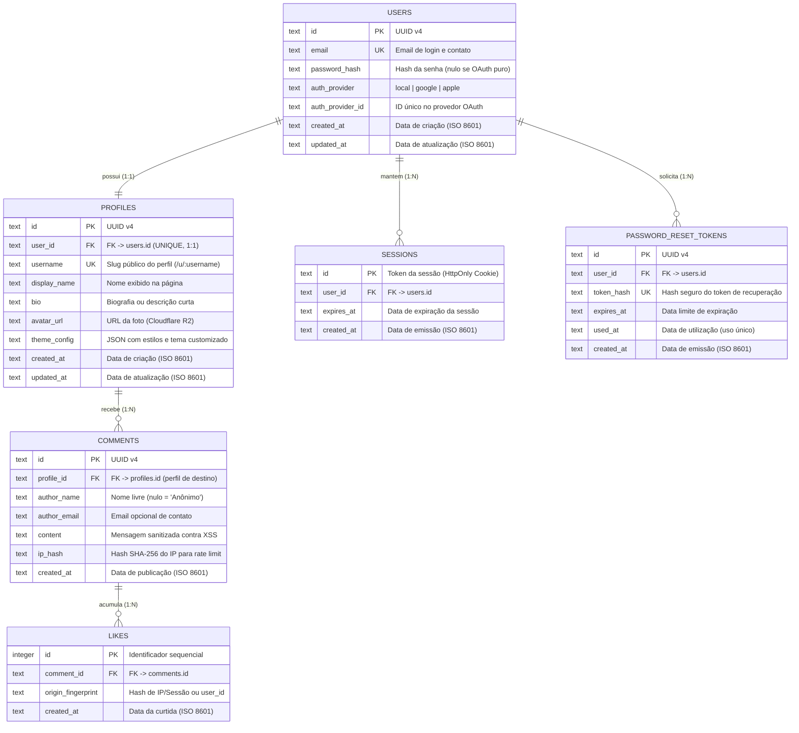

# GuestBook — Diagrama Entidade-Relacionamento (DER)

Este documento especifica a modelagem de dados do **GuestBook**, detalhando o Diagrama Entidade-Relacionamento (DER), o dicionário de dados, as regras de negócio refletidas no esquema e o script DDL para o banco de dados **Cloudflare D1** (SQLite serverless na borda).

---

## 1. Visão Geral da Modelagem

O modelo de dados foi desenhado para atender às características fundamentais do GuestBook:

1. **Assimetria de acesso:** Apenas donos de perfil possuem contas autenticadas. Comentários e curtidas são abertos ao público e não exigem conta de usuário (RF10, RN6).
2. **Separação entre Credenciais e Perfil Público:** Dados sensíveis de autenticação (`users`, `sessions`, `password_reset_tokens`) são isolados dos dados de exibição pública (`profiles`).
3. **Integridade em Cascata:** A exclusão de uma conta remove automaticamente o perfil e todos os comentários e curtidas associados (RF4, RN3, RN10).
4. **Compatibilidade com Cloudflare D1 (SQLite):** Tipagem aderente ao SQLite (`TEXT` para UUIDs, strings e timestamps ISO 8601; `INTEGER` para números e flags).

---

## 2. Diagrama Entidade-Relacionamento (ERD)



---

## 3. Dicionário de Dados

### 3.1 Tabela `users` (Contas de Acesso)
Armazena as informações de autenticação e credenciais dos usuários donos de perfis.

| Coluna | Tipo SQLite | Nulo | Chave | Default | Descrição |
|---|---|:---:|:---:|---|---|
| `id` | `TEXT` | Não | **PK** | — | Identificador universal único (UUID v4). |
| `email` | `TEXT` | Não | **UK** | — | Endereço de email do usuário (minúsculo, normalizado). |
| `password_hash` | `TEXT` | Sim | — | `NULL` | Hash seguro da senha (ex: Argon2id ou bcrypt). Nulo se a conta for autenticada unicamente via OAuth. |
| `auth_provider` | `TEXT` | Não | — | `'local'` | Provedor de cadastro: `'local'`, `'google'`, `'apple'`. |
| `auth_provider_id`| `TEXT` | Sim | — | `NULL` | Identificador do sujeito (`sub`) retornado pelo provedor OAuth externo. |
| `created_at` | `TEXT` | Não | — | `CURRENT_TIMESTAMP` | Data/hora de cadastro em UTC (ISO 8601). |
| `updated_at` | `TEXT` | Não | — | `CURRENT_TIMESTAMP` | Data/hora da última alteração de credenciais. |

> **Índices:**
> - `users(email)`: índice único para lookup rápido na autenticação.
> - `users(auth_provider, auth_provider_id)`: índice para login via OAuth.

---

### 3.2 Tabela `profiles` (Perfis / Guestbooks)
Armazena a página pública de guestbook vinculada à conta do usuário. Cada conta tem exatamente um perfil (RN1).

| Coluna | Tipo SQLite | Nulo | Chave | Default | Descrição |
|---|---|:---:|:---:|---|---|
| `id` | `TEXT` | Não | **PK** | — | Identificador único do perfil (UUID v4). |
| `user_id` | `TEXT` | Não | **FK, UK** | — | Vínculo com a conta dona do perfil (`users.id`). Restrição `UNIQUE` garante relação 1:1. `ON DELETE CASCADE`. |
| `username` | `TEXT` | Não | **UK** | — | Identificador alfanumérico único para a URL pública (ex: `/u/maria`) e buscas (RN2, RF7, RF9). |
| `display_name` | `TEXT` | Não | — | — | Nome de exibição principal da página de guestbook (RF3). |
| `bio` | `TEXT` | Sim | — | `NULL` | Breve biografia ou mensagem de boas-vindas ao visitante. |
| `avatar_url` | `TEXT` | Sim | — | `NULL` | URL pública da imagem de avatar hospedada no Cloudflare R2 (RF3). |
| `theme_config` | `TEXT` | Sim | — | `NULL` | Configuração em formato JSON serializado (cores de fundo, fontes retrô, bordas, CSS seguro) (RF8, RNF5). |
| `created_at` | `TEXT` | Não | — | `CURRENT_TIMESTAMP` | Data/hora de criação do perfil (UTC). |
| `updated_at` | `TEXT` | Não | — | `CURRENT_TIMESTAMP` | Data/hora da última edição dos dados/estilização. |

> **Índices:**
> - `profiles(user_id)`: índice único garantindo integridade 1:1.
> - `profiles(username)`: índice único para resolução instantânea da URL do perfil e buscas (RF7, RN2).

---

### 3.3 Tabela `comments` (Livro de Visitas / Comentários)
Armazena as mensagens postadas no perfil por qualquer visitante. Conforme a regra **RN6**, o comentário não possui chave estrangeira para o autor (é aberto e público).

| Coluna | Tipo SQLite | Nulo | Chave | Default | Descrição |
|---|---|:---:|:---:|---|---|
| `id` | `TEXT` | Não | **PK** | — | Identificador único da mensagem (UUID v4). |
| `profile_id` | `TEXT` | Não | **FK** | — | Perfil onde o comentário foi publicado (`profiles.id`). `ON DELETE CASCADE` (RN3). |
| `author_name` | `TEXT` | Sim | — | `NULL` | Nome informado livremente pelo visitante. Se `NULL` ou vazio, a camada de aplicação/apresentação exibe como `"Anônimo"` (RF11, RN7). |
| `author_email`| `TEXT` | Sim | — | `NULL` | Email opcional informado pelo visitante apenas para contato, sem autenticação (RF11, RN7). |
| `content` | `TEXT` | Não | — | — | Conteúdo textual da mensagem (sanitizado contra XSS conforme RNF4). |
| `ip_hash` | `TEXT` | Sim | — | `NULL` | Hash SHA-256 anônimo do IP de origem para aplicação de rate limiting (RNF1) e mitigação de spam. |
| `created_at` | `TEXT` | Não | — | `CURRENT_TIMESTAMP` | Data/hora de publicação da mensagem (UTC). |

> **Índices:**
> - `comments(profile_id, created_at DESC)`: índice composto fundamental para carregar a listagem de comentários do perfil de forma paginada e cronológica (RNF3).
> - `comments(ip_hash, created_at)`: índice para suporte à verificação de rate limit na borda (RNF1).

---

### 3.4 Tabela `likes` (Curtidas nos Comentários)
Registra as curtidas recebidas pelos comentários. Permite no máximo uma curtida por origem (usuário autenticado ou fingerprint de visitante anônimo) (RF13, RN9).

| Coluna | Tipo SQLite | Nulo | Chave | Default | Descrição |
|---|---|:---:|:---:|---|---|
| `id` | `INTEGER` | Não | **PK** | — | Identificador autoincremental da curtida. |
| `comment_id` | `TEXT` | Não | **FK** | — | Comentário curtido (`comments.id`). `ON DELETE CASCADE` (RN10). |
| `origin_fingerprint` | `TEXT` | Não | — | — | Identificador pseudoanônimo da origem (hash de `IP + User-Agent` ou ID do usuário se logado), garantindo a unicidade por visitante (RN9). |
| `created_at` | `TEXT` | Não | — | `CURRENT_TIMESTAMP` | Data/hora em que a curtida foi registrada (UTC). |

> **Restrições & Índices:**
> - `UNIQUE(comment_id, origin_fingerprint)`: restrição composta essencial que bloqueia curtidas duplicadas da mesma origem no mesmo comentário (RN9).
> - `likes(comment_id)`: índice para contagem veloz de curtidas de um comentário.

---

### 3.5 Tabela `sessions` (Sessões de Autenticação)
Gerencia as sessões ativas geradas pelos fluxos de login local e OAuth no Cloudflare Worker, gravadas no D1 conforme a arquitetura do sistema.

| Coluna | Tipo SQLite | Nulo | Chave | Default | Descrição |
|---|---|:---:|:---:|---|---|
| `id` | `TEXT` | Não | **PK** | — | Token seguro da sessão (passado via cookie `HttpOnly; Secure; SameSite=Lax`). |
| `user_id` | `TEXT` | Não | **FK** | — | Usuário proprietário da sessão (`users.id`). `ON DELETE CASCADE`. |
| `expires_at` | `TEXT` | Não | — | — | Timestamp ISO 8601 indicando o momento em que a sessão expira. |
| `created_at` | `TEXT` | Não | — | `CURRENT_TIMESTAMP` | Data/hora de emissão da sessão. |

> **Índices:**
> - `sessions(user_id)`: índice para invalidar todas as sessões de um usuário em caso de logout geral ou troca de senha.
> - `sessions(expires_at)`: índice para rotinas periódicas de limpeza de sessões expiradas.

---

### 3.6 Tabela `password_reset_tokens` (Recuperação de Senha)
Armazena tokens de recuperação temporários para redefinição de senha esquecida via email (RF6, RN4).

| Coluna | Tipo SQLite | Nulo | Chave | Default | Descrição |
|---|---|:---:|:---:|---|---|
| `id` | `TEXT` | Não | **PK** | — | Identificador único do registro (UUID v4). |
| `user_id` | `TEXT` | Não | **FK** | — | Usuário solicitante (`users.id`). `ON DELETE CASCADE`. |
| `token_hash` | `TEXT` | Não | **UK** | — | Hash seguro (SHA-256) do token aleatório enviado por email através do Resend. |
| `expires_at` | `TEXT` | Não | — | — | Data/hora limite de expiração do link (ex: 1 hora após emissão) (RN4). |
| `used_at` | `TEXT` | Sim | — | `NULL` | Data/hora em que o link foi utilizado. Se não for nulo, impede reutilização (RN4). |
| `created_at` | `TEXT` | Não | — | `CURRENT_TIMESTAMP` | Data/hora em que a solicitação foi feita. |

> **Índices:**
> - `password_reset_tokens(token_hash)`: busca instantânea pelo hash recebido na URL de redefinição.
> - `password_reset_tokens(user_id)`: controle de múltiplos pedidos e revogação anterior.

---

## 4. Mapeamento das Regras de Negócio no Banco de Dados

| Regra de Negócio | Descrição da Regra | Implementação no Esquema de Banco |
|---|---|---|
| **RN1** | Toda conta possui exatamente 1 perfil criado no cadastro. | Relação 1:1 via chave estrangeira `profiles.user_id` com restrição `UNIQUE`. |
| **RN2** | Nome de usuário único para URL pública e busca. | Restrição `UNIQUE` na coluna `profiles.username`. |
| **RN3** | Exclusão de conta remove perfil e comentários permanentemente. | Cláusula `ON DELETE CASCADE` entre `users` -> `profiles` e `profiles` -> `comments`. |
| **RN4** | Link de recuperação com validade limitada e uso único. | Tabela `password_reset_tokens` com campos `expires_at` e `used_at`. O Worker valida: `used_at IS NULL AND expires_at > CURRENT_TIMESTAMP`. |
| **RN5** | Redefinição pode ter senha igual à anterior. | O banco não armazena histórico de senhas nem impõe restrição contra valores anteriores. |
| **RN6** | Comentar nunca exige autenticação. | A tabela `comments` possui FK apenas para o perfil de destino (`profile_id`); **não há** coluna de autor vinculada a `users`. |
| **RN7** | Nome e email do autor são livres e opcionais. | Colunas `author_name` e `author_email` em `comments` são `NULLABLE`. |
| **RN8** | Somente o dono do perfil pode excluir comentários recebidos. | Regra de autorização na API/Worker: valida se `comments.profile_id` pertence ao `user_id` da sessão ativa. |
| **RN9** | Apenas um like por origem por comentário. | Restrição composta `UNIQUE(comment_id, origin_fingerprint)` na tabela `likes`. |
| **RN10** | Excluir comentário remove os likes associados. | Cláusula `ON DELETE CASCADE` na FK `likes.comment_id REFERENCES comments(id)`. |
| **RN11 / RN12** | Widget reflete os mesmos comentários do perfil ativo. | O widget consulta exatamente a mesma tabela `comments` filtrando pelo `profile_id` ativo. |
| **RN13** | Notificação de comentário por email se conta ativa. | O Worker faz o `JOIN` entre `comments.profile_id` -> `profiles.user_id` -> `users.email` para acionar a API do Resend. |

---

## 5. Decisões Arquiteturais e de Modelagem

1. **Separação `users` vs `profiles`:**
   - Evita expor dados críticos de conta (email, hashes de senha, provedores OAuth) em consultas públicas de perfil.
   - Permite que o perfil público seja facilmente cacheado na CDN da Cloudflare sem risco de vazamento de credenciais.

2. **Armazenamento de Assets no Cloudflare R2:**
   - As fotos de perfil e eventuais imagens de fundo não são salvas como binários (`BLOB`) no banco relacional. Apenas a URL/chave resultante do upload no Cloudflare R2 é persistida na coluna `avatar_url`.

3. **Configuração de Estilização em JSON (`theme_config`):**
   - Para suportar a customização do guestbook (RF8) sem criar tabelas excessivas para cores, fontes e molduras, utiliza-se uma coluna de texto armazenando um objeto JSON estruturado e validado na borda.

4. **Tratamento de Concorrência e Performance:**
   - O Cloudflare D1 distribui réplicas de leitura automaticamente. Leituras públicas de comentários (`comments` + contagem de `likes`) são extremamente rápidas graças ao índice composto `(profile_id, created_at DESC)`.

---

## 6. Script DDL Completo (Cloudflare D1 / SQLite)

O script SQL a seguir pode ser executado diretamente através do utilitário `wrangler d1 execute`:

```sql
-- Habilitar integridade de chaves estrangeiras no SQLite
PRAGMA foreign_keys = ON;

-- -----------------------------------------------------
-- 1. Tabela: users
-- -----------------------------------------------------
CREATE TABLE IF NOT EXISTS users (
    id TEXT PRIMARY KEY,
    email TEXT NOT NULL COLLATE NOCASE,
    password_hash TEXT,
    auth_provider TEXT NOT NULL DEFAULT 'local',
    auth_provider_id TEXT,
    created_at TEXT NOT NULL DEFAULT CURRENT_TIMESTAMP,
    updated_at TEXT NOT NULL DEFAULT CURRENT_TIMESTAMP
);

CREATE UNIQUE INDEX IF NOT EXISTS idx_users_email ON users(email);
CREATE INDEX IF NOT EXISTS idx_users_oauth ON users(auth_provider, auth_provider_id);

-- -----------------------------------------------------
-- 2. Tabela: profiles
-- -----------------------------------------------------
CREATE TABLE IF NOT EXISTS profiles (
    id TEXT PRIMARY KEY,
    user_id TEXT NOT NULL UNIQUE,
    username TEXT NOT NULL COLLATE NOCASE,
    display_name TEXT NOT NULL,
    bio TEXT,
    avatar_url TEXT,
    theme_config TEXT,
    created_at TEXT NOT NULL DEFAULT CURRENT_TIMESTAMP,
    updated_at TEXT NOT NULL DEFAULT CURRENT_TIMESTAMP,
    CONSTRAINT fk_profiles_user FOREIGN KEY (user_id) REFERENCES users(id) ON DELETE CASCADE
);

CREATE UNIQUE INDEX IF NOT EXISTS idx_profiles_user_id ON profiles(user_id);
CREATE UNIQUE INDEX IF NOT EXISTS idx_profiles_username ON profiles(username);

-- -----------------------------------------------------
-- 3. Tabela: comments
-- -----------------------------------------------------
CREATE TABLE IF NOT EXISTS comments (
    id TEXT PRIMARY KEY,
    profile_id TEXT NOT NULL,
    author_name TEXT,
    author_email TEXT,
    content TEXT NOT NULL,
    ip_hash TEXT,
    created_at TEXT NOT NULL DEFAULT CURRENT_TIMESTAMP,
    CONSTRAINT fk_comments_profile FOREIGN KEY (profile_id) REFERENCES profiles(id) ON DELETE CASCADE
);

CREATE INDEX IF NOT EXISTS idx_comments_profile_date ON comments(profile_id, created_at DESC);
CREATE INDEX IF NOT EXISTS idx_comments_rate_limit ON comments(ip_hash, created_at);

-- -----------------------------------------------------
-- 4. Tabela: likes
-- -----------------------------------------------------
CREATE TABLE IF NOT EXISTS likes (
    id INTEGER PRIMARY KEY AUTOINCREMENT,
    comment_id TEXT NOT NULL,
    origin_fingerprint TEXT NOT NULL,
    created_at TEXT NOT NULL DEFAULT CURRENT_TIMESTAMP,
    CONSTRAINT fk_likes_comment FOREIGN KEY (comment_id) REFERENCES comments(id) ON DELETE CASCADE,
    CONSTRAINT uk_likes_origin UNIQUE (comment_id, origin_fingerprint)
);

CREATE INDEX IF NOT EXISTS idx_likes_comment_id ON likes(comment_id);

-- -----------------------------------------------------
-- 5. Tabela: sessions
-- -----------------------------------------------------
CREATE TABLE IF NOT EXISTS sessions (
    id TEXT PRIMARY KEY,
    user_id TEXT NOT NULL,
    expires_at TEXT NOT NULL,
    created_at TEXT NOT NULL DEFAULT CURRENT_TIMESTAMP,
    CONSTRAINT fk_sessions_user FOREIGN KEY (user_id) REFERENCES users(id) ON DELETE CASCADE
);

CREATE INDEX IF NOT EXISTS idx_sessions_user_id ON sessions(user_id);
CREATE INDEX IF NOT EXISTS idx_sessions_expires_at ON sessions(expires_at);

-- -----------------------------------------------------
-- 6. Tabela: password_reset_tokens
-- -----------------------------------------------------
CREATE TABLE IF NOT EXISTS password_reset_tokens (
    id TEXT PRIMARY KEY,
    user_id TEXT NOT NULL,
    token_hash TEXT NOT NULL UNIQUE,
    expires_at TEXT NOT NULL,
    used_at TEXT,
    created_at TEXT NOT NULL DEFAULT CURRENT_TIMESTAMP,
    CONSTRAINT fk_reset_tokens_user FOREIGN KEY (user_id) REFERENCES users(id) ON DELETE CASCADE
);

CREATE UNIQUE INDEX IF NOT EXISTS idx_reset_tokens_hash ON password_reset_tokens(token_hash);
CREATE INDEX IF NOT EXISTS idx_reset_tokens_user_id ON password_reset_tokens(user_id);
```
